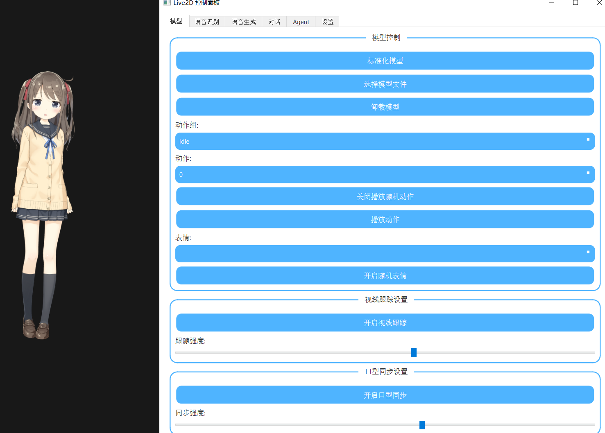

# AI Vtuber 虚拟桌宠伙伴系统

本项目实现了一个基于AI的虚拟桌宠伙伴系统，结合了大型语言模型和语音合成技术，提供低延迟的实时对话体验，轻量化，全python。

## 功能特点

- **双引擎并行**：同时集成ollama和GPTsovits引擎（api_v2,具体参考GPTsovits），实现高效稳定的对话处理
- **低延迟对话**：优化语音识别和合成流程，实现快速响应
- **Live2D支持**：支持Live2D v3模型
- **实时语音同步**：通过mic_lipsync模块实现口型与语音的精确同步
- **模块化设计**：包含LLM、TTS、STT等独立模块，便于扩展和维护

## 部署使用

1. 安装依赖：
   ```bash
   pip install -r requirements.txt
   ```

2. 配置环境变量.env(不需要引号)：
   ```bash
   DEEPSEEK_API_KEY = ""
   ```

3. 运行主程序：
   ```bash
   python main.py
   ```
4. 演示：
   右键模型可以打开对话窗口，开启关闭语音输入，语音输出
   

## 事项
- [x] GPTsovits 对接
- [x] deepseek api对接
- [X] stream流语音合成并行处理
- [ ] 接入Cosyvoice语音合成
- [ ] 记忆实现
- [ ] 游戏性、互动性、情绪性、成长性
- [ ] LLM人物姿态驱动  

## 鸣谢

本项目使用了以下开源库和资源：

- **[live2d-py](https://github.com/Arkueid/live2d-py)**：提供live2d角色模型加载和动画支持
- **[ollama](https://ollama.com/)**：用于语言模型推理
- **[GPTsovits](https://ollama.com/)**：用于语音合成
- **[realtimeSTT](https://github.com/Arkueid/live2d-py)**：用于音频实时识别
- **其他依赖库**：详见requirements.txt

特别感谢所有开源社区贡献者和项目维护者。

## 项目结构

```
.
├── ControlPanel.py        # 控制面板
├── Live2DWindow.py        # Live2D显示窗口
├── LLM.py                 # 语言模型模块
├── STT.py                 # 语音识别模块
├── TTS.py                 # 语音合成模块
├── mic_lipsync.py         # 口型同步模块
├── main.py                # 主程序
├── Haru/                  # Haru角色资源
├── hiyori/                # hiyori角色资源
└── logs/                  # 日志记录
```

## 注意事项

- 请确保系统已安装最新版本的Python和pip
- 首次运行时可能需要下载模型文件，请保持网络连接
- 建议使用NVIDIA GPU以获得最佳性能
